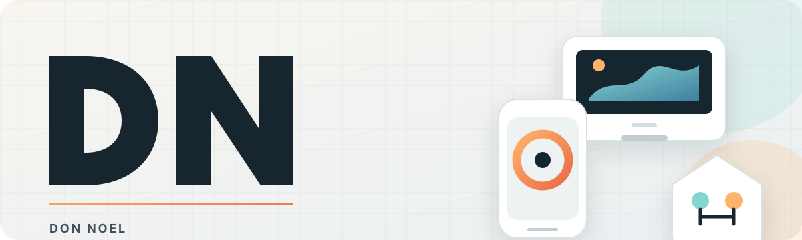
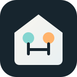
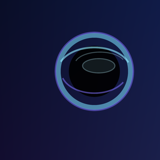
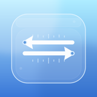

<picture>
  <source media="(prefers-color-scheme: dark)" srcset="./assets/profile-hero-dark.svg">
  <source media="(prefers-color-scheme: light)" srcset="./assets/profile-hero-light.svg">
  
</picture>

  I build thoughtful products for Apple platforms, Android, the web, and Raspberry Pi. 
  Clear purpose, visible state, and the smallest thing that works well.

  <a href="https://apps.apple.com/us/developer/don-noel/id1852862173"><strong>App Store</strong></a>
  &nbsp;·&nbsp;
  <a href="#featured-work"><strong>Featured work</strong></a>
  &nbsp;·&nbsp;
  <a href="https://github.com/donnoel?tab=repositories"><strong>All repositories</strong></a>

 

## Featured work

<h3>&nbsp; Coloring Room</h3>

<em>Shipped · iPad and Apple Pencil</em> 
A focused coloring studio with resilient saved progress, thoughtful organization, and natural Pencil-first drawing. 
<a href="https://donnoel.github.io/Coloring/"><strong>Project page</strong></a> · <a href="https://apps.apple.com/us/app/coloring-room/id6761619332">App Store</a> · <a href="https://github.com/donnoel/Coloring">Source</a>

<h3>&nbsp; Glow Daily Practice</h3>

<em>Shipped · iPhone, iPad, and widgets</em> 
A calm habit tracker built around daily rhythm, visible momentum, useful reminders, and celebration without pressure. 
<a href="https://donnoel.github.io/Glow/"><strong>Project page</strong></a> · <a href="https://apps.apple.com/us/app/glow-daily-practice/id6755254758">App Store</a> · <a href="https://github.com/donnoel/Glow">Source</a>

<h3>&nbsp; Beam</h3>

<em>Systems · Web and Raspberry Pi</em> 
Local-first digital signage designed around continuous playback, deliberate publishing, honest status, and boringly reliable recovery. 
<a href="https://donnoel.github.io/beamscreens/"><strong>Project page</strong></a> · <a href="https://github.com/donnoel/beamscreens">Public overview</a>

<h3>&nbsp; Agents House</h3>

<em>Exploring · Native macOS and AI</em> 
A foundation for small AI residents whose requests, permissions, actions, and accountability stay visible to the person in charge. 
<a href="https://donnoel.github.io/AgentsHouse/"><strong>Project page</strong></a> · <a href="https://github.com/donnoel/AgentsHouse">Source</a>

## Shipped on the App Store

  &nbsp;
  &nbsp;
  &nbsp;
  &nbsp;
  

  <a href="https://donnoel.github.io/Pause/"><strong>Pause</strong></a> ·
  <a href="https://donnoel.github.io/Glow/"><strong>Glow</strong></a> ·
  <a href="https://donnoel.github.io/Driftly/"><strong>Driftly</strong></a> ·
  <a href="https://donnoel.github.io/Coloring/"><strong>Coloring</strong></a> ·
  <a href="https://donnoel.github.io/Conversion/"><strong>Easy Units</strong></a>

Source:
  <a href="https://github.com/donnoel/Pause">Pause</a> ·
  <a href="https://github.com/donnoel/Glow">Glow</a> ·
  <a href="https://github.com/donnoel/Driftly">Driftly</a> ·
  <a href="https://github.com/donnoel/Coloring">Coloring</a> ·
  <a href="https://github.com/donnoel/Conversion">Easy Units</a>

  <a href="https://apps.apple.com/us/developer/don-noel/id1852862173"><strong>View the complete App Store collection →</strong></a>

## Current projects

### Apple & Android

[Briefly](https://github.com/donnoel/Briefly) ([page](https://donnoel.github.io/Briefly/)) · [Chicane](https://github.com/donnoel/Chicane) ([page](https://donnoel.github.io/Chicane/)) · [Glow for Android](https://github.com/donnoel/GlowAndroid) ([page](https://donnoel.github.io/GlowAndroid/)) · [Ketch](https://github.com/donnoel/Ketch) ([page](https://donnoel.github.io/Ketch/)) · [Tick](https://github.com/donnoel/Tick) ([page](https://donnoel.github.io/Tick/))

### AI & macOS

[Agents House](https://github.com/donnoel/AgentsHouse) ([page](https://donnoel.github.io/AgentsHouse/)) · [Loom](https://github.com/donnoel/Loom) ([page](https://donnoel.github.io/Loom/)) · [Project Pilot](https://github.com/donnoel/ProjectPilot) ([page](https://donnoel.github.io/ProjectPilot/))

### Web & devices

[Beam](https://github.com/donnoel/beamscreens) ([page](https://donnoel.github.io/beamscreens/)) · [Pulseboard](https://github.com/donnoel/Pulseboard) ([page](https://donnoel.github.io/Pulseboard/))

## How I build

**Understandable software.** Interfaces and systems should make their state clear without asking people to reverse-engineer them.

**Focused iteration.** Small changes, explicit boundaries, accessibility, and human review keep useful products maintainable.

**Reliable delivery.** Validation, recovery paths, and honest readiness matter as much as the happy path.

SwiftUI · SpriteKit · Kotlin · Jetpack Compose · Next.js · AWS · Raspberry Pi

